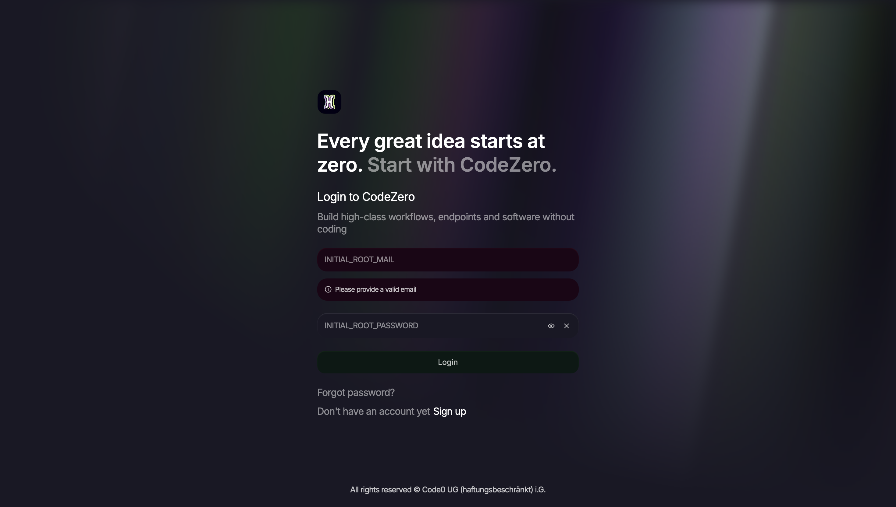
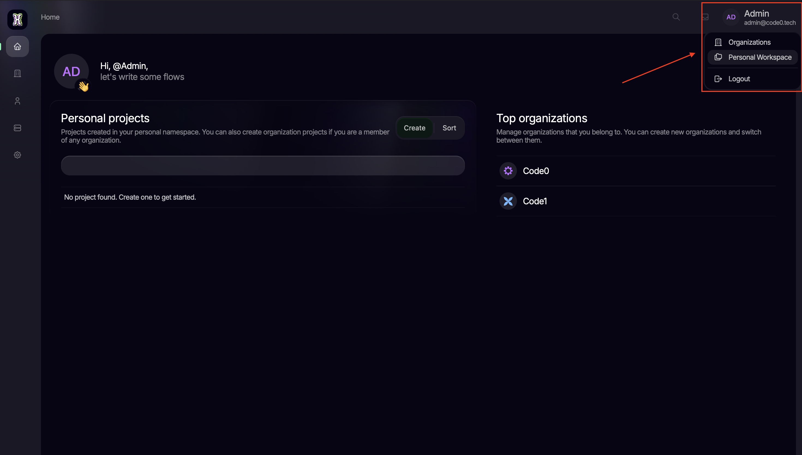
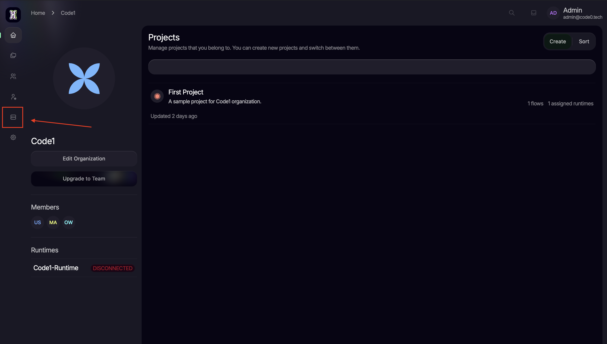
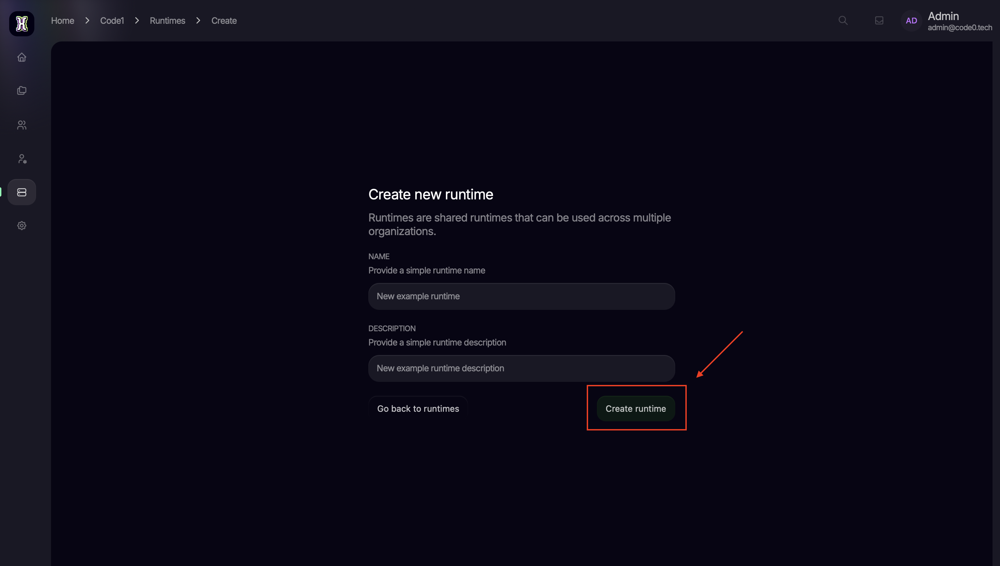
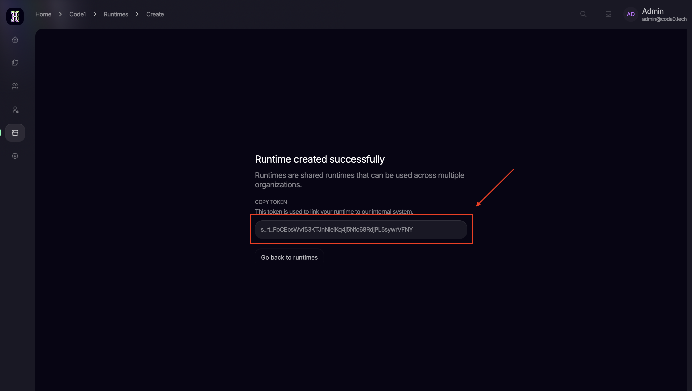

import {Step, Steps} from 'fumadocs-ui/components/steps';

This guide will walk you through the deployment of CodeZero using Docker. Currently, CodeZero is in active development,
and we are focused on building our community of early adopters. Follow these steps to set up your environment and
connect your first runtime.

## Prerequisites

Before beginning, ensure you have the following installed on your system:

- Git
- Docker and Docker Compose

<Steps>

    <Step>

        ## Clone the latest release

        To ensure stability, we recommend using the latest release. Run the following command to clone the
        repository:

        Get the newest release version from the [CodeZero GitHub releases page](https://github.com/code0-tech/codezero/releases)

        ```bash
        git clone --branch <version> https://github.com/code0-tech/codezero.git
        ```

        Navigate to the deployment directory:

        ```bash
        cd codezero/docker-compose/
        ```

    </Step>
    <Step>
        ## Configure environment variables

        CodeZero uses an `.env` file to manage initial credentials and system settings. Create or edit the file:

        ```bash
        nano .env
        ```

        ### The .env template

        Ensure your `.env` file contains the following variables. Pay close attention to the Root Credentials and the
        Image
        Edition.

        ```bash
        # IDE config
        HOSTNAME=localhost
        HTTP_PORT=80
        HTTPS_PORT=443
        SSL_ENABLED=false
        SSL_CERT_FILE= # must be located in ./certs, defaults to "<hostname>.pem"
        SSL_KEY_FILE= # must be located in ./certs, defaults to "<hostname>.key"

        INITIAL_ROOT_PASSWORD=root
        INITIAL_ROOT_MAIL=root@code0.tech

        # Runtime config
        AQUILA_SAGITTARIUS_URL=http://nginx:80
        AQUILA_SAGITTARIUS_TOKEN=
        DRACO_REST_PORT=8084

        # Active services
        COMPOSE_PROFILES=ide,runtime

        # Image config
        IMAGE_REGISTRY=registry.gitlab.com/code0-tech/packages
        IMAGE_TAG= # version
        IMAGE_EDITION= # ce or ee

        # Internal config options
        SAGITTARIUS_RAILS_HOST=sagittarius-rails-web
        SAGITTARIUS_RAILS_PORT=3000
        SAGITTARIUS_GRPC_HOST=sagittarius-grpc
        SAGITTARIUS_GRPC_PORT=50051
        SAGITTARIUS_LOG_LEVEL=info
        SCULPTOR_HOST=sculptor
        SCULPTOR_PORT=3000
        POSTGRES_HOST=postgres
        POSTGRES_PORT=5432
        POSTGRES_DB=sagittarius_production
        POSTGRES_USER=sagittarius
        POSTGRES_PASSWORD=sagittarius
        ```

        ### Key parameters:

        - `INITIAL_ROOT_MAIL`: The email address for the primary administrator.
        - `INITIAL_ROOT_PASSWORD`: The secure password for your first login.
        - `IMAGE_EDITION`: Set this to ce for the Community Edition or ee for the Enterprise Edition. This
        determines which Docker images will be pulled.

    </Step>
    <Step>

        ## Initial deployment

        Start the CodeZero containers in detached mode:

        ```bash
        docker compose up -d
        ```

        Once the containers are running, you can access the CodeZero Dashboard via your browser (typically
        at http://localhost/).

    </Step>
    <Step>

        ## Connecting the runtime

        A "Runtime" is the engine that executes your flows. To activate it, you must generate a unique token within the
        dashboard and link it to your configuration.

        ### Login

        Log in to the dashboard using the `INITIAL_ROOT_MAIL` and `INITIAL_ROOT_PASSWORD` you defined in your `.env`
        file.

        

        ### Create organization or navigate to personal workspace

        

        ### Navigate to runtimes

        

        ### Create new runtime

        

        ### Copy the generated token

        

        ### Update your `.env` file

        Update your .env file with the copied token at `AQUILA_SAGITTARIUS_TOKEN` and save the file.

    </Step>
    <Step>

        ## Finalize the setup

        For the changes to take effect and for the runtime to authenticate correctly, restart the containers:

        ```bash
        docker compose restart
        ```
    </Step>

</Steps>

Your CodeZero instance is now fully configured and ready to manage your enterprise flows and organizational structures.
