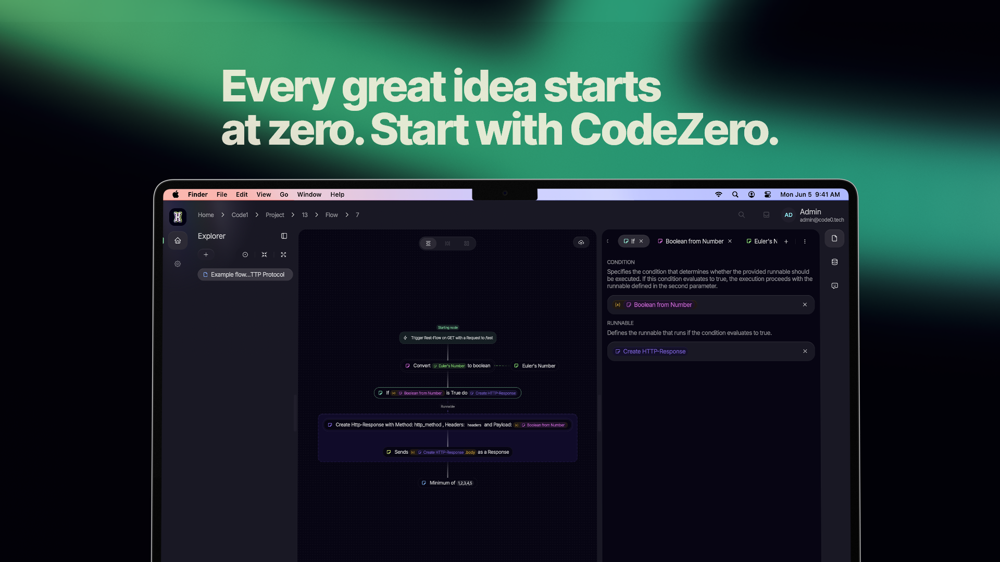

CodeZero is a versatile open-source platform designed to streamline how businesses manage operations, automate complex
processes, and organize professional ecosystems. In a corporate world where data and tasks are often scattered across
various tools, CodeZero provides a centralized architecture to bring your projects, teams, and business logic into one
unified workspace.

## Revolutionizing Business Process Management

At its core, CodeZero is built around the concept of Flows. A Flow is a visual representation of a business process,
where individual steps are connected to automate logic, data handling, and integrations. For enterprise users, this
means the ability to transform manual, time-consuming procedures into efficient, automated systems that run reliably in
the background.

## Enterprise Grade Capabilities

CodeZero is engineered to meet the demands of modern B2B environments through several key pillars:

- Organizational Hierarchy: Manage complex structures with ease. You can define Organizations, create specific Projects,
  and manage Members with granular precision.

- Role Based Access Control: Security and compliance are central to any enterprise. CodeZero allows you to define
  specific Roles and permissions, ensuring that every team member has exactly the access they need and nothing more.

- Scalable Infrastructure: The platform is designed to grow alongside your company. Whether you are managing a single
  department or an international corporation, the modular system adapts to your scale.

- Hybrid Deployment & Data Sovereignty: For companies with strict data privacy requirements, CodeZero offers unique
  flexibility. You can utilize our interface while keeping your actual data processing on your own local infrastructure,
  maintaining full control over your information.

## The Future of Collaborative Automation

CodeZero bridges the gap between high-level organizational management and granular task automation. It acts as the
digital backbone for your company, allowing teams to collaborate on complex projects while the system handles the
repetitive "heavy lifting."

We are currently focused on growing a professional community of early adopters and contributors. This is an opportunity
for businesses to help shape a tool that prioritizes modularity, transparency, and efficiency. By integrating CodeZero
into your workflow, you are not just adopting a tool; you are joining a movement toward more open, adaptable, and
powerful business management.