import { Tab, Tabs } from 'fumadocs-ui/components/tabs';
import { Callout } from 'fumadocs-ui/components/callout';
import { Step, Steps } from 'fumadocs-ui/components/steps';
import { Cards, Card } from 'fumadocs-ui/components/card';

We will build a simple flow that listens for a `GET` request and immediately answers back with a classic `pong`.

---

<Steps>
<Step>

## Kickstart a new flow

Let's begin by creating a fresh canvas. Click the create button to get started.

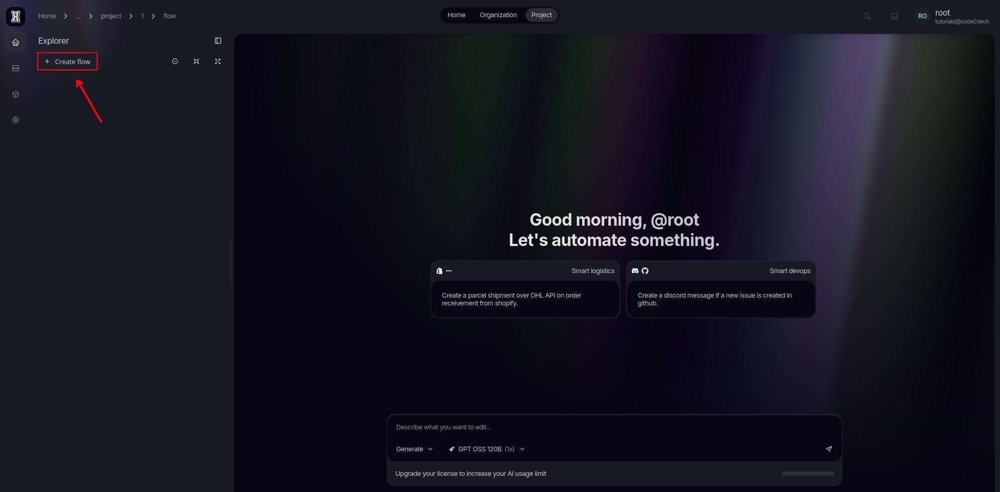

Set the trigger type to **REST Endpoint**, give your flow a memorable name, and hit create to open up your new workspace.

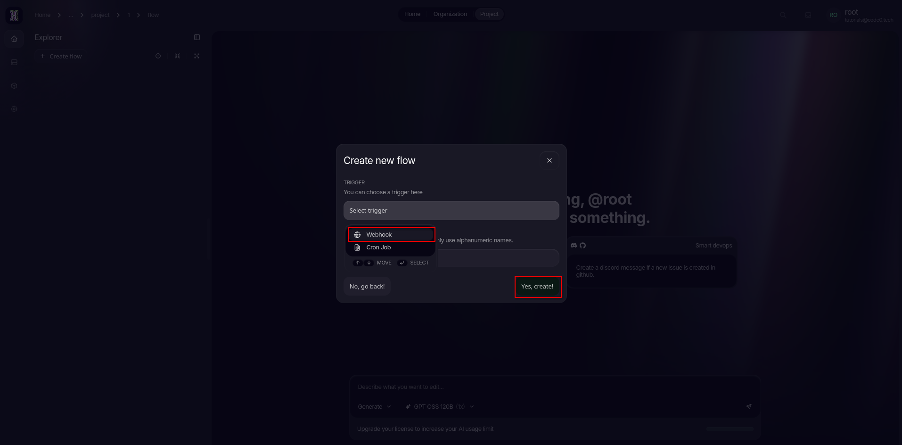

</Step>
<Step>

## Access the node settings

Locate and open your newly created flow from the explorer list.

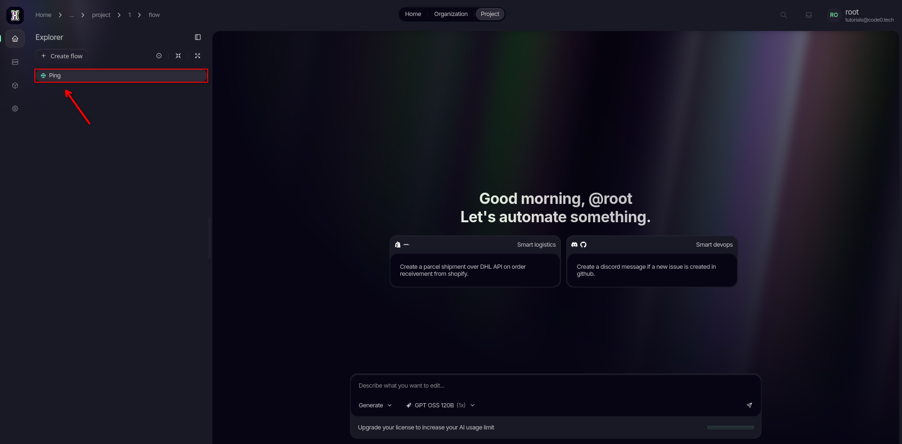

Click on the **Starting Node** to highlight it. Then, take a look at the right-hand side of your screen and open up the **Node Settings** panel. This is where the magic configuration happens.

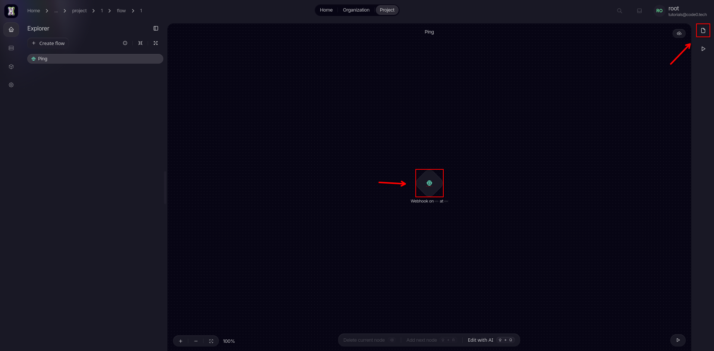

Form here we can start setting up our starting node.

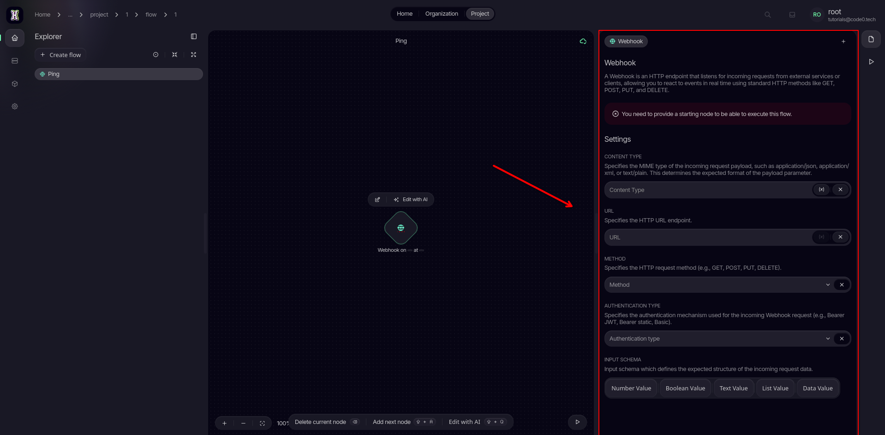

</Step>
<Step>

### Configure your endpoint & logic

First, let's define the data type. Click on the variable **(x)** icon and select `text/plain` from the list.

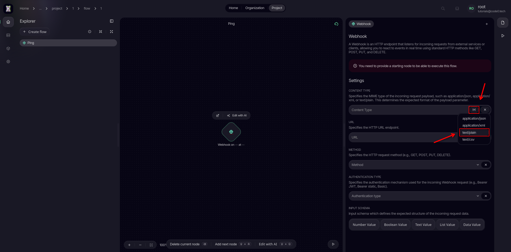

Next, let's give your flow an address. Type a clean path like `/ping` into the URL endpoint field.

<Callout type="info">
  💡 **What is a URL endpoint?** This acts as the unique web path for your flow. When combined with your specific project slug, it forms the full web address you will use to trigger this logic.
</Callout>

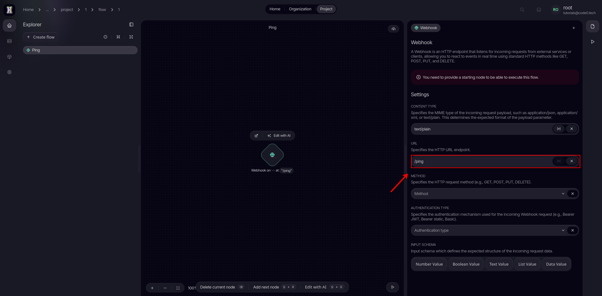

Choose the `GET` method from the dropdown menu. We are using `GET` for this project so you can easily test and preview the results right inside your favorite web browser.

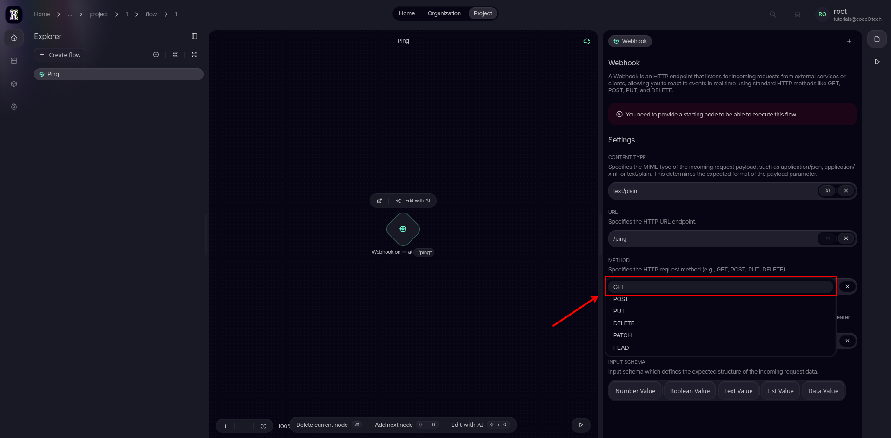

Set the incoming input schema to `Data Value` to keep the format simple and clean.

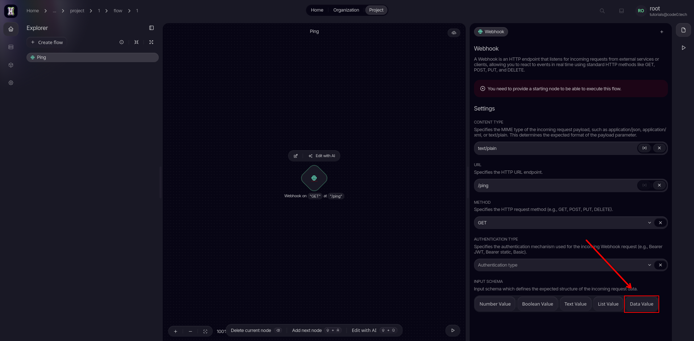

</Step>
<Step>

#### Add a responde node

Now, let's add some action! Open up the **Node Menu** to browse available blocks.

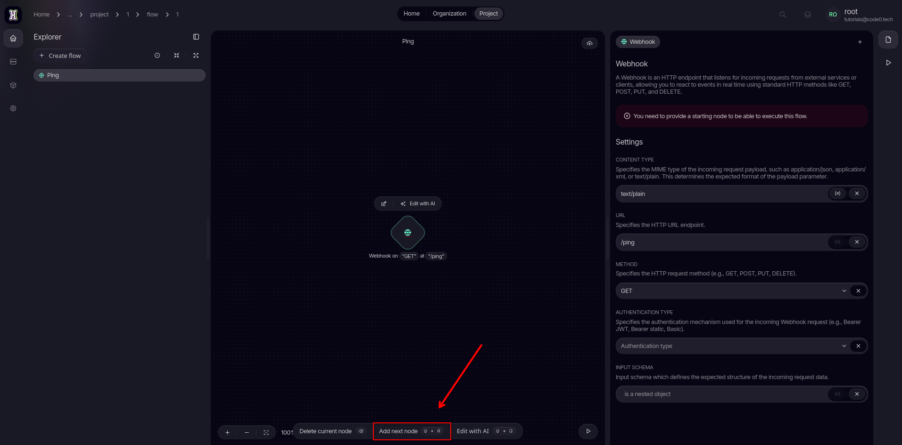

Type `Respond` into the search bar and select the corresponding node to add it to your workflow canvas.

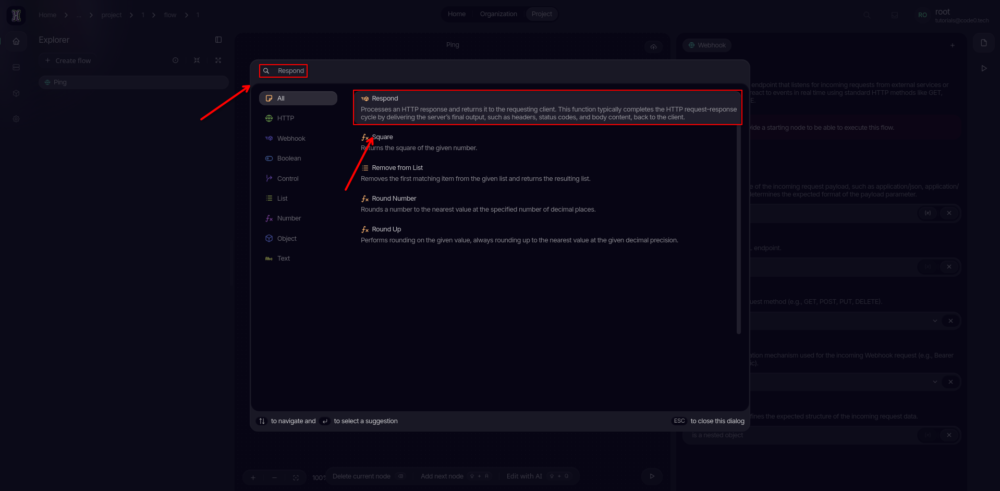

Click on the newly placed **Respond** node to configure.

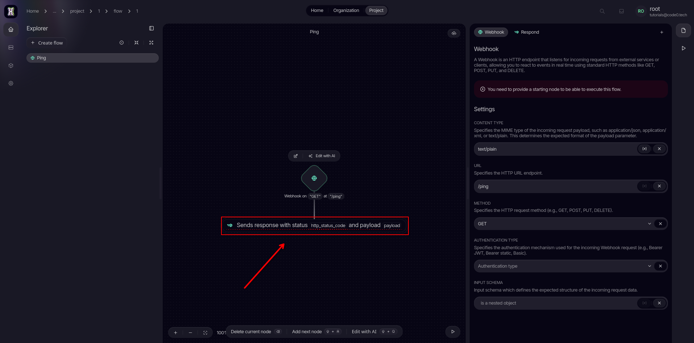

Let's tell the client everything went smoothly. Set the **Status Code** to `200` (the standard HTTP code for "OK").

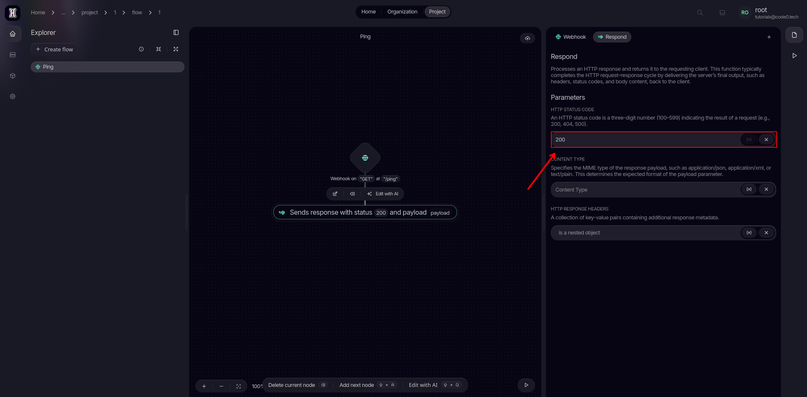

Just like before, use the **(x)** variable icon to set the response content type to `text/plain`.

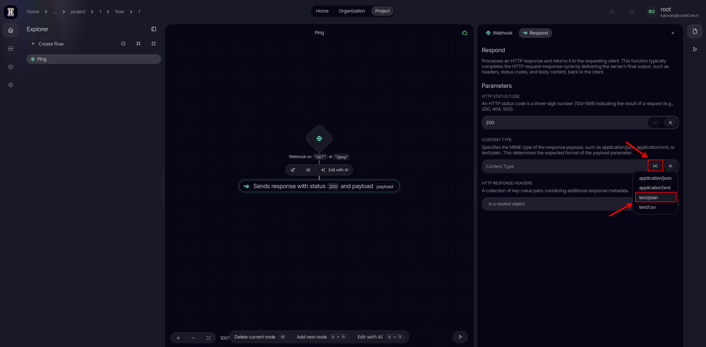

Type the word `pong` into the content field. This is the exact text payload that will be sent back to the user.

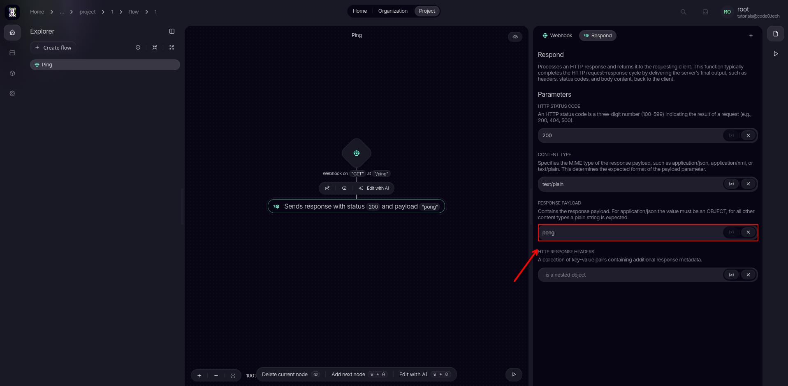

Don't lose your progress! Click the **Save** button in the toolbar.

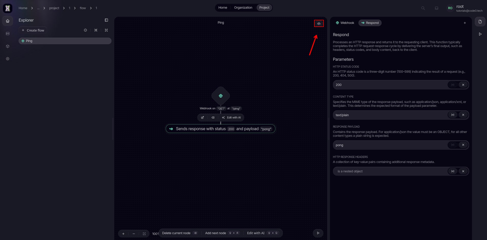

</Step>
<Step>

#### Try out your flow

Time to test it out! Click on the **Play** button and copy the resulting HTTP URL to your clipboard.

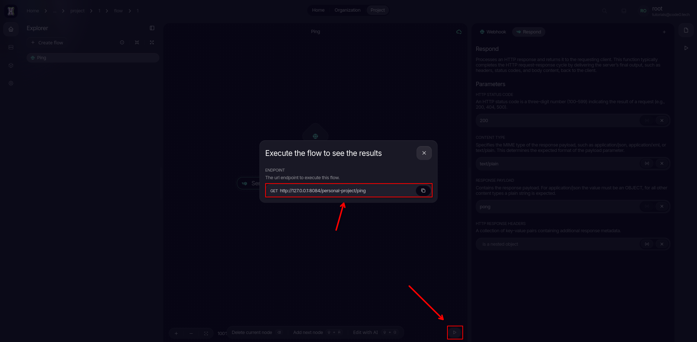

Finally, paste the copied link into a new browser tab.
If you are developing locally, feel free to adjust the IP address or host if needed.
Hit enter, and watch your flow instantly reply with `pong`!

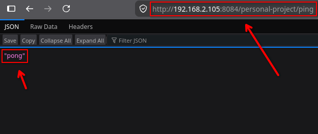

</Step>
</Steps>

---

### What are my next steps?

Congratulations on deploying your very first endpoint!
Now that you know how to receive a request and send a basic response,
you can try passing dynamic data variables or adding conditional logic nodes to make your flow even smarter.
