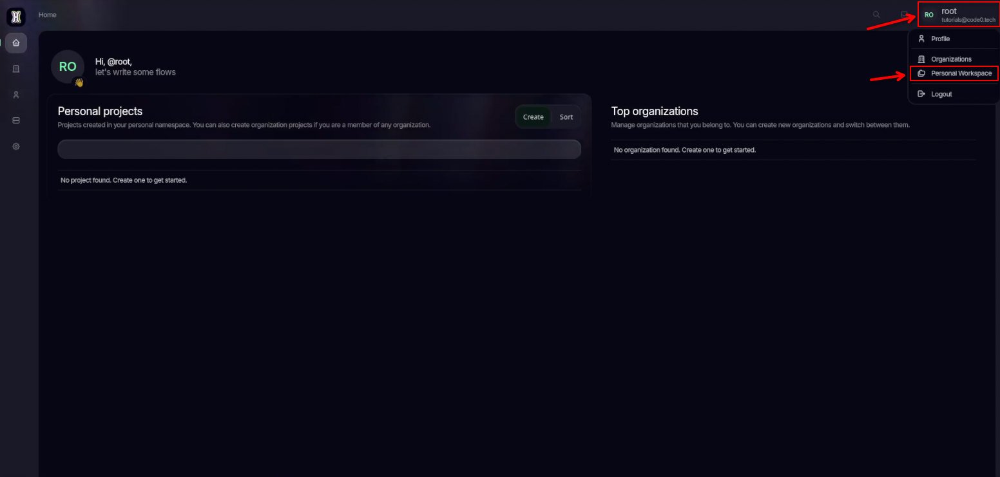
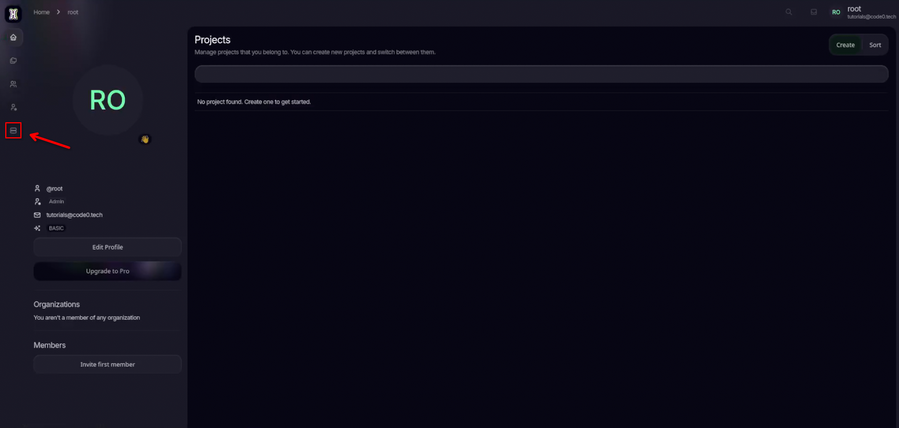
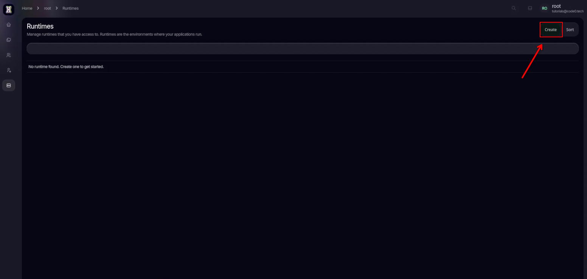
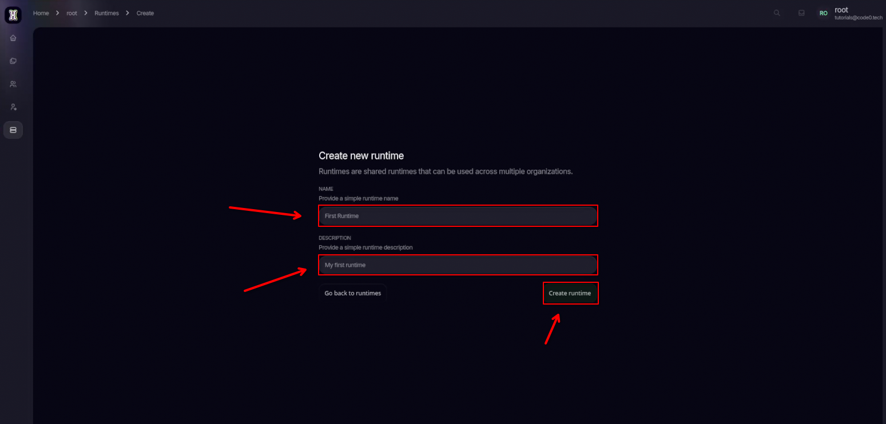
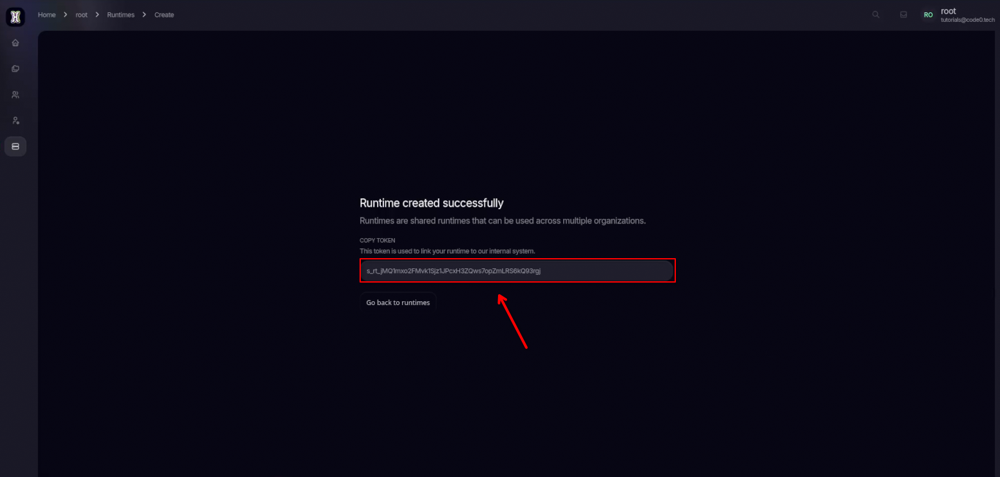
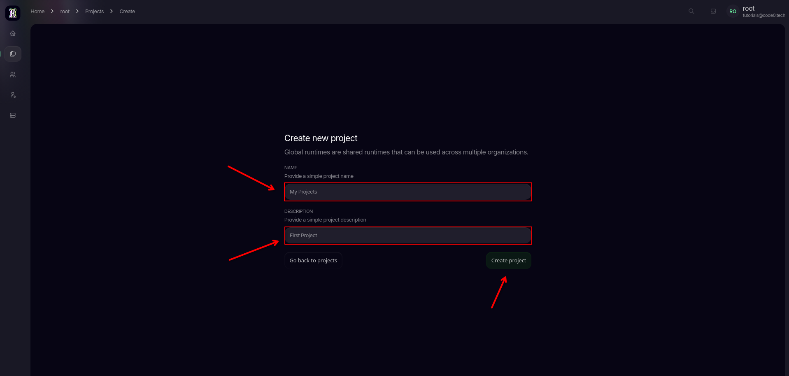

import { Tab, Tabs } from 'fumadocs-ui/components/tabs';
import { Callout } from 'fumadocs-ui/components/callout';
import { Step, Steps } from 'fumadocs-ui/components/steps';
import { Cards, Card } from 'fumadocs-ui/components/card';

Welcome to the **Quick - First Flow** Tutorial! In this guide, we’ll walk through all steps from your current installtion to your first flow.

<Callout type="info">
  **Prerequisite:** Ensure you have completed the first 3 steps from the [Installation Process](/general/install) before proceeding.
</Callout>

<Steps>
<Step>

## Login into the Web IDE

To access the IDE, you need to visit the URL defined in your `.env` file. Open your environment configuration to verify the `HOSTNAME` and `PORT`:

```bash title=".env"
# IDE config
# [!code highlight:3]
HOSTNAME=localhost
HTTP_PORT=80
HTTPS_PORT=443
SSL_ENABLED=false
SSL_CERT_FILE= # must be located in ./certs, defaults to "<hostname>.pem"
SSL_KEY_FILE= # must be located in ./certs, defaults to "<hostname>.key"

INITIAL_ROOT_PASSWORD=myWebPassword
INITIAL_ROOT_MAIL=tutorials@code0.tech
INITIAL_RUNTIME_TOKEN= # can be used to create a global runtime with given token

# Runtime config
AQUILA_SAGITTARIUS_URL=http://nginx:80
AQUILA_SAGITTARIUS_TOKEN=
DRACO_REST_PORT=8084
...
```

<Tabs items={['Local Access', 'Remote Access']}>
  <Tab value="Local Access">
    ### Local Machine
    If you are running the ide in docker on your current computer, use the loopback address.
    
    ```text
    http://localhost
    ```
    
    <Callout type="info">
      This only works if the browser and the server are on the same device.
    </Callout>
  </Tab>
  
  <Tab value="Remote Access">
    ### Remote Server
    If you are accessing a server on your local network, use the Static IP address.
    
    ```text
    http://192.168.2.105
    ```
    
    **Instructions:**
    1. Find your server IP (on linux headless using `ip addr`).
    2. Replace `192.168.2.105` with your actual IP.
    3. Ensure port `80` is open in your firewall settings.
  </Tab>
</Tabs>

Once you have opened the correct URL in your browser, the login screen will appear. Enter the credentials you defined in your .env file.

```bash title=".env"
# IDE config
HOSTNAME=localhost
HTTP_PORT=80
HTTPS_PORT=443
SSL_ENABLED=false
SSL_CERT_FILE= # must be located in ./certs, defaults to "<hostname>.pem"
SSL_KEY_FILE= # must be located in ./certs, defaults to "<hostname>.key"

# [!code highlight:2]
INITIAL_ROOT_PASSWORD=myWebPassword
INITIAL_ROOT_MAIL=tutorials@code0.tech
INITIAL_RUNTIME_TOKEN= # can be used to create a global runtime with given token

# Runtime config
AQUILA_SAGITTARIUS_URL=http://nginx:80
AQUILA_SAGITTARIUS_TOKEN=
DRACO_REST_PORT=8084
...
```

Enter the `INITIAL_ROOT_MAIL` and `INITIAL_ROOT_PASSWORD` into their corresponding login fields, then click **Login**.


</Step>
<Step>


</Step>
## Creating a Runtime
Once logged in you will see this page, where you need to click onto your User account, then Personal Projects




Then go to the Runtime tab on the left



Press `Create` to open the config for a new Runtime



Enter a `Name` and a `Description` then click `Create Runtime`



After that copy the shown token...




... and paste it into your .env after `AQUILA_SAGITTARIUS_TOKEN=`

```bash title=".env"
# IDE config
HOSTNAME=localhost
HTTP_PORT=80
HTTPS_PORT=443
SSL_ENABLED=false
SSL_CERT_FILE= # must be located in ./certs, defaults to "<hostname>.pem"
SSL_KEY_FILE= # must be located in ./certs, defaults to "<hostname>.key"

INITIAL_ROOT_PASSWORD=myWebPassword
INITIAL_ROOT_MAIL=tutorials@code0.tech
INITIAL_RUNTIME_TOKEN= # can be used to create a global runtime with given token

# Runtime config
AQUILA_SAGITTARIUS_URL=http://nginx:80
# [!code highlight:1]
AQUILA_SAGITTARIUS_TOKEN=Your_Token_Here
DRACO_REST_PORT=8084
...
```

For the changes to take effect so that the runtime can authenticate correctly, restart the containers using:

```bash
docker compose up -d
```


<Step>

## Create a Personal Project

Now that you have created a runtime we can add it to and Projects, since we currenlty have no projects lets create one first.
For that navigate back to your home screen by clicking on `Home`


From there press `Create` under `Personal projects`


Enter a `Name` and `Description` then click `Create project`



</Step>

</Steps>