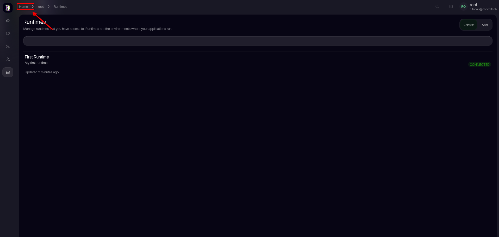
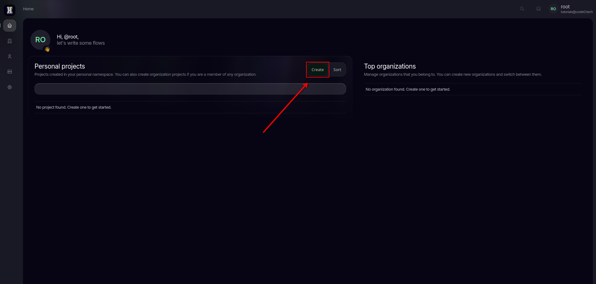
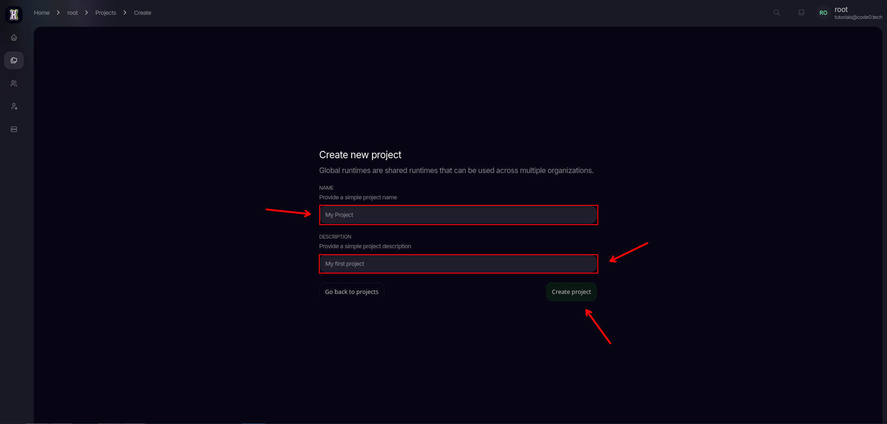

import { Tab, Tabs } from 'fumadocs-ui/components/tabs';
import { Callout } from 'fumadocs-ui/components/callout';
import { Step, Steps } from 'fumadocs-ui/components/steps';
import { Cards, Card } from 'fumadocs-ui/components/card';

<Steps>
<Step>

Now that you have created a runtime we can add it to and Projects, since we currenlty have no projects lets create one first.
For that navigate back to your home screen by clicking on `Home`

From there press `Create` under `Personal projects`

Enter a `Name` and `Description` then click `Create project`

</Step>
</Steps>