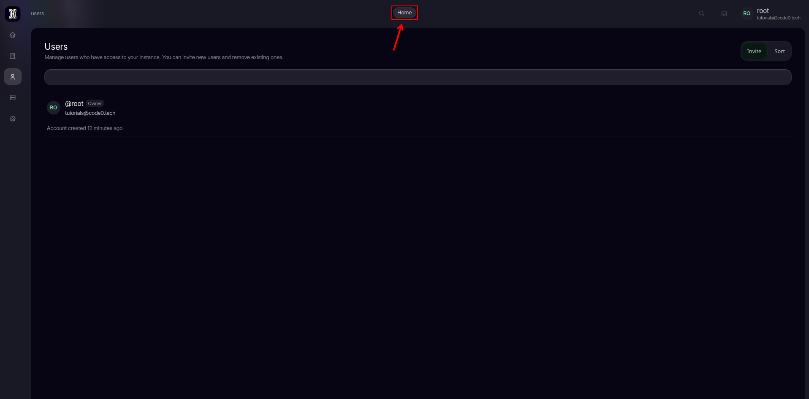
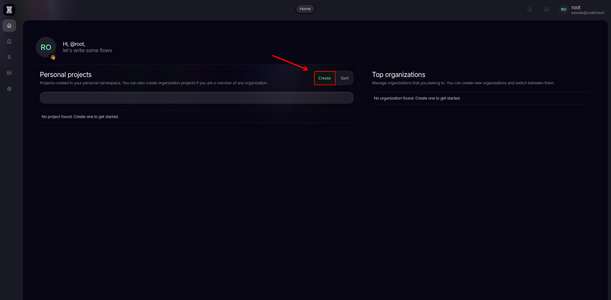
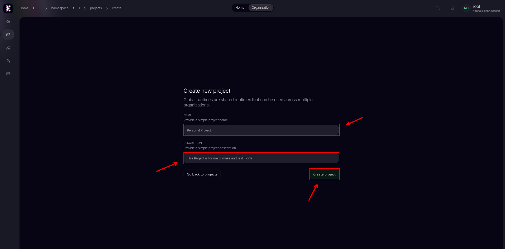

import { Tab, Tabs } from 'fumadocs-ui/components/tabs';
import { Callout } from 'fumadocs-ui/components/callout';
import { Step, Steps } from 'fumadocs-ui/components/steps';
import { Cards, Card } from 'fumadocs-ui/components/card';

Let's walk through setting up a dedicated workspace for your private automations.
Creating a personal project provides you with a sandbox environment to build, test, and run your individual flows securely.

---

<Steps>
<Step>

## Return to the homepage

To begin creating your personal project, navigate back to your main dashboard screen by clicking on the **Home** button in the navigation bar.

</Step>
<Step>

## Initialize the project creation

Once you are on the homepage, locate the **Personal projects** section and click on the **Create** button to open the project configuration wizard.

</Step>
<Step>

## Enter your project details

Provide a clear **Name** and a helpful **Description** for your workspace so you can easily identify its purpose later. Once filled out, click **Create project** to finalize the setup.

</Step>
<Step>

## Explore your new workspace

Congratulations! Your personal project has been successfully initialized. You are now looking at your private project dashboard, ready to configure runtimes or deploy your very first flow. 🎉

</Step>
</Steps>

---

### What are my next steps?

Now that your private sandbox is ready, you need to connect an runtime to run your automation logic.
Head over to our **Setting up a project** guide to attach your runtime environment and customize your routing slug.
