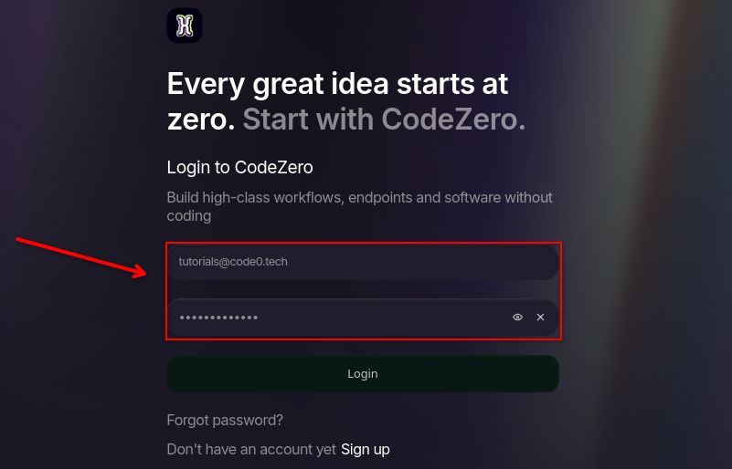

import { Tab, Tabs } from 'fumadocs-ui/components/tabs';
import { Callout } from 'fumadocs-ui/components/callout';
import { Step, Steps } from 'fumadocs-ui/components/steps';
import { Cards, Card } from 'fumadocs-ui/components/card';

Welcome to the **Quick Tutorials**! In this guide, we’ll walk through all steps from your current installtion to your first flow.

<Callout type="info">
  **Prerequisite:** Ensure you have completed the steps from the [Installation Process](/general/install) before proceeding.
</Callout>

<Steps>
<Step>

To access the IDE, you need to visit the URL defined in your `.env` file. Open your environment configuration to verify the `HOSTNAME` and `PORT`:

```bash title=".env"
# IDE config
# [!code highlight:3]
HOSTNAME=localhost
HTTP_PORT=80
HTTPS_PORT=443
SSL_ENABLED=false
SSL_CERT_FILE= # must be located in ./certs, defaults to "<hostname>.pem"
SSL_KEY_FILE= # must be located in ./certs, defaults to "<hostname>.key"

INITIAL_ROOT_PASSWORD=myWebPassword
INITIAL_ROOT_MAIL=tutorials@code0.tech
INITIAL_RUNTIME_TOKEN= # can be used to create a global runtime with given token

# Runtime config
AQUILA_SAGITTARIUS_URL=http://nginx:80
AQUILA_SAGITTARIUS_TOKEN=
DRACO_REST_PORT=8084
...
```

<Tabs items={['Local Access', 'Remote Access']}>
  <Tab value="Local Access">
    ### Local Machine
    If you are running the ide in docker on your current computer, use the loopback address.
    
    ```text
    http://localhost
    ```
    
    <Callout type="info">
      This only works if the browser and the docker container are on the same device.
    </Callout>
  </Tab>
  
  <Tab value="Remote Access">
    ### Remote Server
    If you are accessing a server on your local network, use the its IP address.
    
    ```text
    http://192.168.2.105
    ```
    
    **Instructions:**
    1. Find your server IP (PS: On linux headless type `ip addr` copy that address).
    2. Replace `192.168.2.105` with your actual IP.
    3. Ensure port `80` is open in your firewall settings.
  </Tab>
</Tabs>

Once you have opened the correct URL in your browser, the login screen will appear. Enter the credentials you defined in your .env file.

```bash title=".env"
# IDE config
HOSTNAME=localhost
HTTP_PORT=80
HTTPS_PORT=443
SSL_ENABLED=false
SSL_CERT_FILE= # must be located in ./certs, defaults to "<hostname>.pem"
SSL_KEY_FILE= # must be located in ./certs, defaults to "<hostname>.key"

# [!code highlight:2]
INITIAL_ROOT_PASSWORD=myWebPassword
INITIAL_ROOT_MAIL=tutorials@code0.tech
INITIAL_RUNTIME_TOKEN= # can be used to create a global runtime with given token

# Runtime config
AQUILA_SAGITTARIUS_URL=http://nginx:80
AQUILA_SAGITTARIUS_TOKEN=A_TOKEN
DRACO_REST_PORT=8084
...
```

Enter the `INITIAL_ROOT_MAIL` and `INITIAL_ROOT_PASSWORD` into their corresponding login fields, then click **Login**.


</Step>
</Steps>