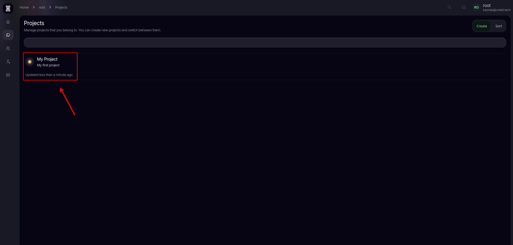
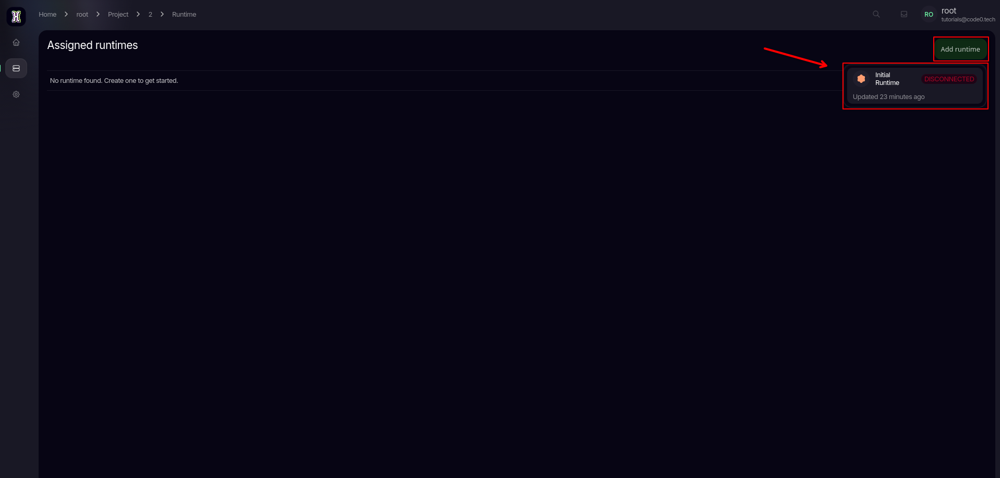
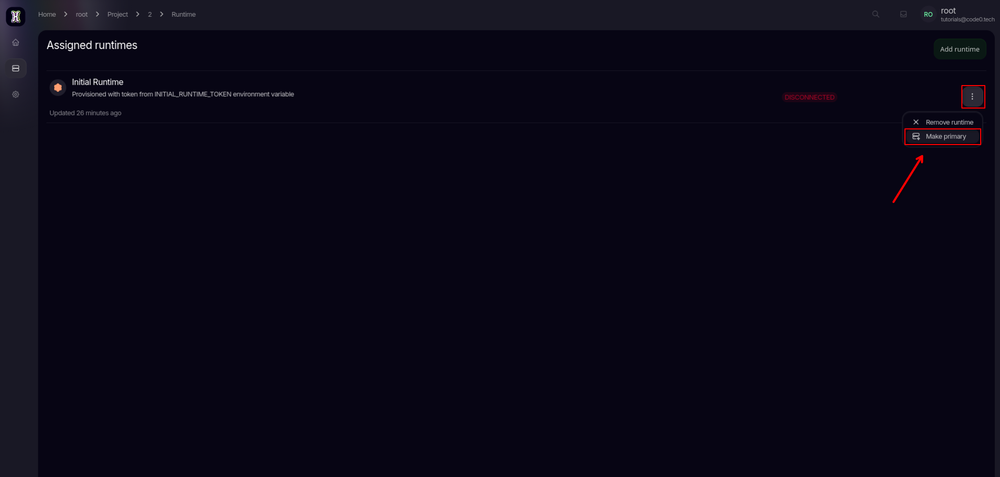
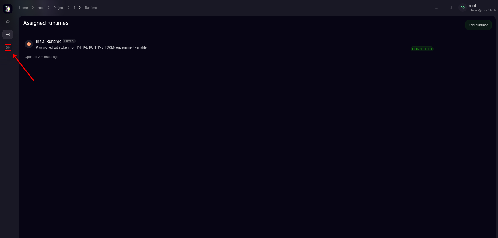
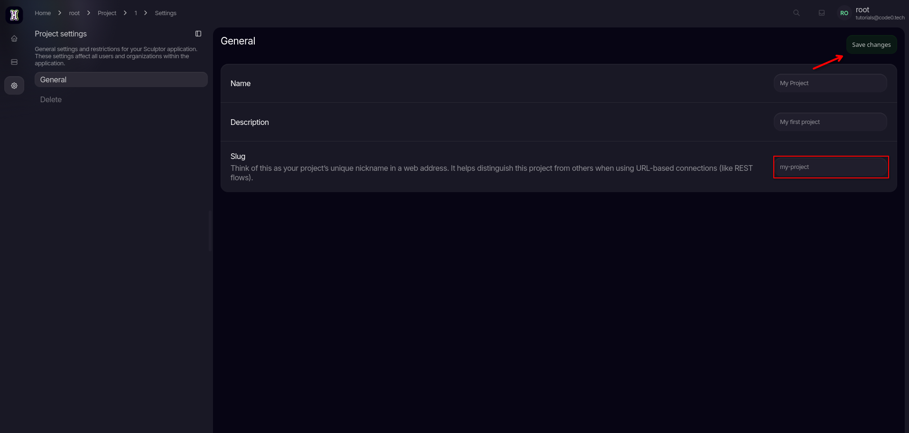
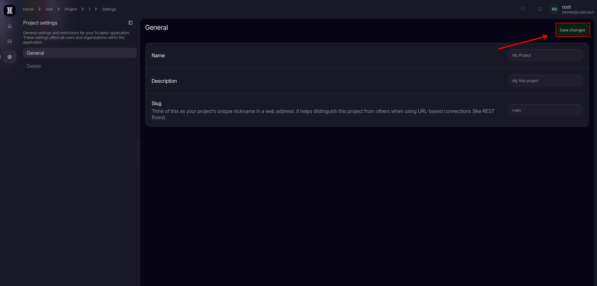
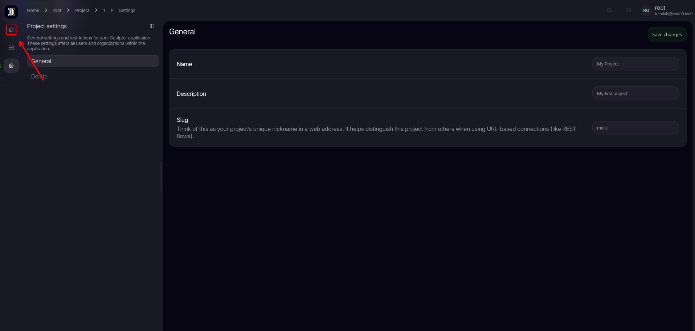
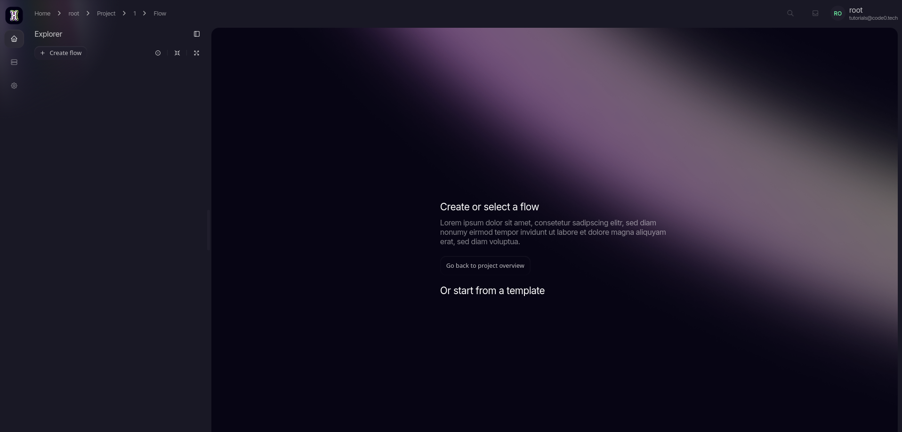

import { Tab, Tabs } from 'fumadocs-ui/components/tabs';
import { Callout } from 'fumadocs-ui/components/callout';
import { Step, Steps } from 'fumadocs-ui/components/steps';
import { Cards, Card } from 'fumadocs-ui/components/card';

<Steps>
<Step>
Go to your created project you want to setup

</Step>
<Step>
Then go to the Runtime tab

Then add your Runtime

Make the added Runtime Primary

</Step>
<Step>

Navigate to your Project settings

Edit the slug to your prefered route

<Callout type="info">
This slug will be used later as the path to your flow:

`http://localhost:<DRACO_REST_PORT>/<your-new-slug>/<flow-path>`
</Callout>

</Step>
<Step>
Navigate to Flows

<Callout type="info">
Here you can start creating flows
</Callout>

</Step>
</Steps>